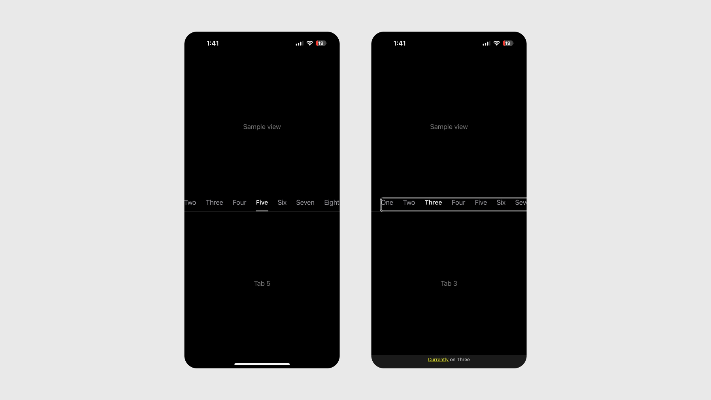

# Underline Nav in SwiftUI
Underline Nav is a custom segmented control that utilizes SwiftUI's `TabView`.

Accessibility improvements allow VoiceOver users to swipe up/down to activate different tabs and swipe right/left to skip to the content—a quick and intuitive experience.

**All feedback welcome.**

## Why?
For assistive technology users, custom segmented controls such as underline navigations typically require a user to swipe through every single tab before arriving to the desired content. This can be a confusing and tedious experience.

SwiftUI's `accessibilityAdjustableAction` affords a custom mode of interaction, which I've used here to create a secondary navigation inside Underline Nav.

## Credits
- Jared Davidson, @Archetaoo, [UnderlineTabFinal](https://github.com/Archetapp/UnderlineTabBarFinal)
- Majid Jabrayilov, @mecid, [Accessibility actions in SwiftUI](https://swiftwithmajid.com/2021/04/15/accessibility-actions-in-swiftui/)
